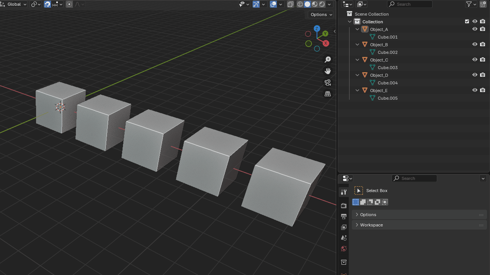

# Kerberos Interactive Data Renamer (KIDR) for Blender




A lightweight, high-performance Blender add-on that batch renames the data-blocks of selected objects to match their respective object names. It's designed to be extremely fast and stable, handling thousands of objects in an instant without freezing Blender.


---

## ✨ Features

* **Blazing Fast:** Batch renames thousands of object data-blocks instantly. Engineered for optimal performance by using direct data access instead of slow, repetitive operators.
* **Simple & Focused:** One operator, one purpose. No bloated UI or unnecessary features.
* **Safe by Design:** Includes safety checks to prevent unintentionally renaming shared (multi-user) data and avoids errors with objects that have no data-blocks (like Empties).
* **Convenient Access:** Run the tool from the `Object` menu in the 3D Viewport or use the default hotkey (_Ctrl+Alt+R_) for even faster access.

---

## 💾 Installation

1.  Go to the [Releases page](https://github.com/KerberosInteractive/KIDR/releases) and download the latest `kidr.py` file.
2.  In Blender, go to `Edit > Preferences > Add-ons`.
3.  Click the **Install...** button at the top-right.
4.  Select the `.py` file you just downloaded.
5.  Find "Kerberos Interactive Data Renamer" in the list and check the box to enable it.

---

## 🚀 How to Use

The operator will only be active when you are in **Object Mode** and have **at least one object selected**.

### Via the Menu

1.  Select one or more objects in the 3D Viewport.
2.  Navigate to the menu: `Object > Rename Data to Object Name`.
3.  Click it to run the operator.

### Via the Shortcut

1.  Select one or more objects in the 3D Viewport.
2.  Press the hotkey: **`Ctrl + Alt + R`**.

A status message will appear at the bottom of the screen confirming how many objects were renamed and how many were skipped.

---

## ⚡ Performance-First Design

The core goal of this add-on is speed, especially for scenes with a large number of objects.

Many scripts perform batch operations by calling a Blender operator (`bpy.ops`) inside a loop. This is inefficient because each call forces Blender to update parts of the scene, evaluate dependencies, and add an entry to the undo stack. For 2,000 objects, this can mean 2,000 individual updates, leading to a long freeze.

KIDR avoids this entirely. It uses Blender's direct Python API to modify the data in memory:

```python
# This is slow
for obj in objects:
    bpy.ops.object.rename_data(name=obj.name) # Fictional example

# This is fast (the method KIDR uses)
for obj in objects:
    obj.data.name = obj.name